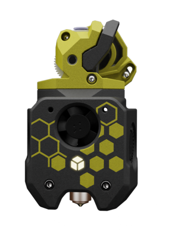

# A4T Toolhead

A4T link

(list all the options for this toolhead, and the relevant mods)

<table>
<tr><th>Toolhead</th><th>Details</th></tr>
<tr>
	<td valign=top><strong><a href="A4T.md">A4T 
	</a></strong>
	</td>
	<td valign=top><ul><li>Slightly less supported with mods, but performance is supposed to be good.</li>
	<li>Requires Shorter Z joints like <a href="https://github.com/VoronDesign/VoronUsers/tree/main/printer_mods/hartk1213/Voron2.4_GE5C">Ge5C z-joints</a> so you don't bottom out your carriage when homing.</li>
		<li>Requires new smaller front idlers like the <a href="https://github.com/clee/VoronBFI">BFI</a> or <a href="https://github.com/DraftShift/StealthChanger/tree/main/UserMods/BT123/MiniBFI%20%2B%20MicroBFI">Mini BFI</a></li>
	</ul></td></tr>

  </table>
