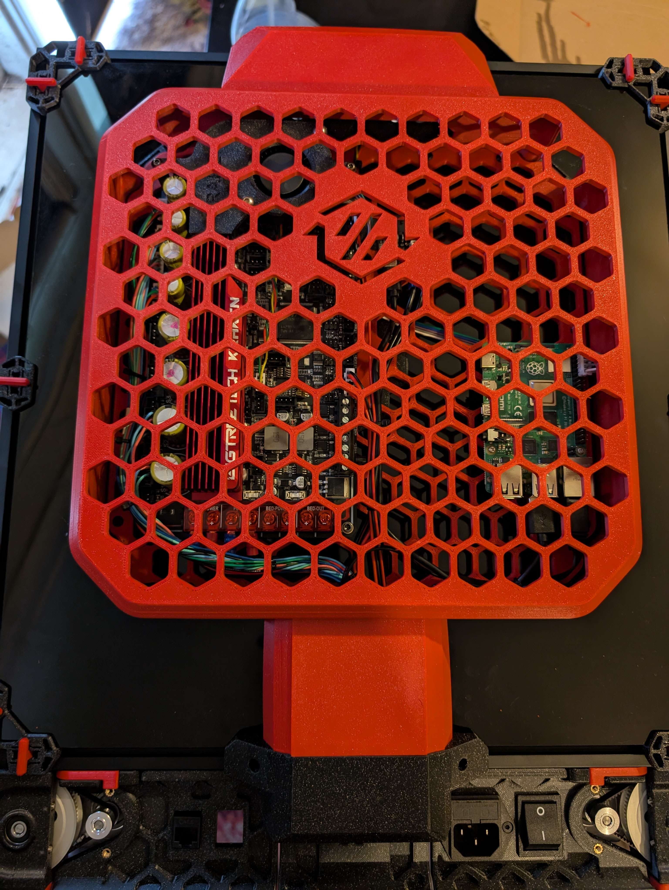
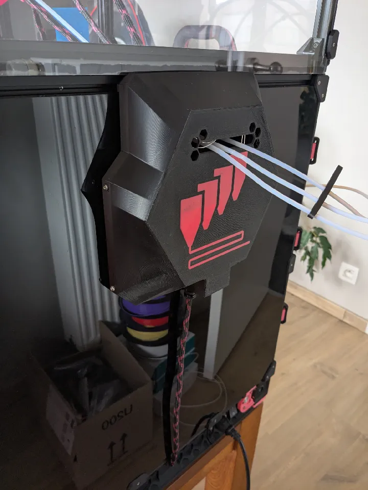
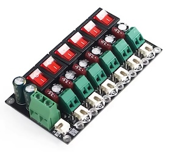
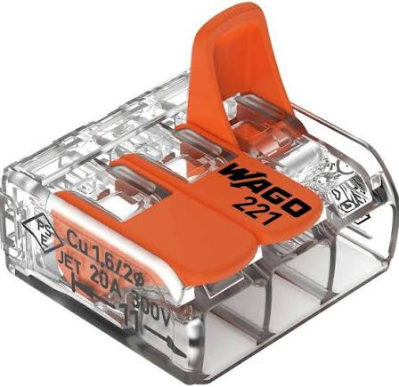

<!-- Use the page layout at TOC.md:  https://github.com/sdylewski/StealthChanger/blob/main/docs/TOC.md -->

# Electrical Distribution
The backpack contains the electrical system and distributes power and data to each toolhead. 

## Backpack options

### [DraftShift FannyPack](https://github.com/DraftShift/CableManagement/tree/main/FannyPack)
[Recommended] This is the most used system to create a backpack to mount distribution boards and clean up the mess at the back. It works with most (all?) distribution boards with many options.  
 
<b>Note:</b>  Even though there are other umbilical mounting methods in this repository, most new builds are using the exhaust plate by N3MI to handle the umbilicals, shown in green in the image above.

### [Hexa backpack](https://github.com/MikeYankeeOscarBeta/hexabackpack)
  
There is also this Hexa backpack from @MikeYankeeOscarBeta for general mounting on the back of the printer.

### [Fystec Hexa Distro Fusion backpack](https://www.printables.com/model/1366367-fysetc-hexa-distro-fusion-backpack)
 
Another mod by @drakarah to mount a Fystec Distro Fusion board to the back of your printer.

### [Modular backpack](https://github.com/onsimon/modular-backpack)

# Distribution Boards
You need to be able to talk to all your toolheads. CAN bus is recommended. It seems USB is possible also with the Fystec Hexa Distro Fusion board. Pick one of these below.
## Typical boards

<table>
	<tr><th>Distribution board</th><th>Notes</th></tr>
	<tr><td><a href="https://docs.ldomotors.com/en/Toolboard/Nitehawk-Hexa">LDO Nighthawk Hexa</a> 
		</td>
		<td><ul><li>Comes in LDO kit</li>
			<li>CAN only</li>
			<li>No fuses or switches</li>
		</ul></td></tr>
	<tr><td><a href="https://wiki.fysetc.com/docs/hexa_distro_fusion">Fystec hexa distro fusion</a> 
		</td>
		<td><ul><li>6 USB and CAN ports</li>
			<li>7.5A fuses and power switches</li>
			<li>Extra fan ports & IOs</li>
		</ul></td></tr>
	<tr><td><a href="">Fystec CAN Distrobution board</a> 
		</td><td><ul>
			<li>6 CAN ports and power</li>
			<li>7.5A fuses and power switches</li>
			<li>Really bad documentation, <a href="https://github.com/FYSETC/Tool-Distribution-Board/blob/main/TBD%20Wiring.jpg">only one image for documentation</a>. Be careful with power polarity!</li>
		</ul></td></tr>
	<tr><td><a href="https://store.isiks.tech/products/birds-nest-can">Birds' nest CAN hub by Isik's Tech</a> 
		</td>
		<td><ul><li>6 CAN ports</li>
			<li>No fuses or switches</li>
			<li>6 filament sensor ports</li>
			<li>6 Thermistor ports</li>
			<li>Additional expansion ports</li>
			<li>2x 5V ARGB connectors</li>
		</ul></td></tr>
	<tr><td>WAGO connectors 
	</td><td>
	<ul><li>Cheap option</li>
	<li>Can work for CAN also?</li>
	<li>no fuses or switches</li>
	</ul>
	Just connect all your V_in, GND, CAN_L and CAN_H respectively together with Wagos.
	</td></tr>
</table>
 

## Power
Make sure that the V_in and GND wire that goes from the PSU to your wago's or distribution board has a thicker gauge as it will carry the power of all the toolheads combined. To calculate the wire gauge, calculate the max power consumption of all your toolheads combined, take a healthy margin and use a wire gauge calculator that gives you the cross section or AWG required.

## CAN termination layout and common issues

Unless the toolheads are daisy chained together the CAN bus is more of a CAN star network. That is out of spec but is usually fine. Terminate the CAN bus with 2 termination resistors (usually you have jumpers for that) as usual, one on the main board, one on one of the toolheads. Omit the jumper on the rest of the toolheads to prevent reducing the resistance between CAN L and CAN H.

If you have SB2209s however you might need to add more termination resistors. Add one termination resistor at the time and test if all the boards get picked up, if not add more or move them around, it's unclear what's causing the SB2209 to be more sensitive to reflections, other boards don't have this issue.

Other common issues are usually resolved by going through [Esoterical's CAN guide](https://canbus.esoterical.online/), it's the same process for each toolhead.

The Fystec USB-CAN adapter is recommended over the BTT one if you need to add CAN to your main board.

