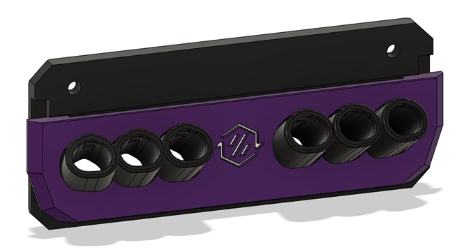
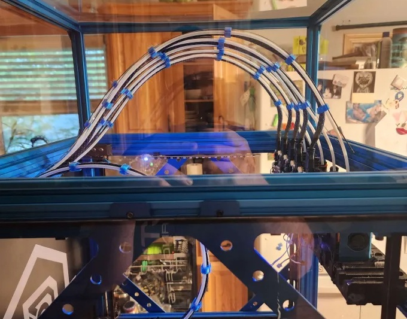
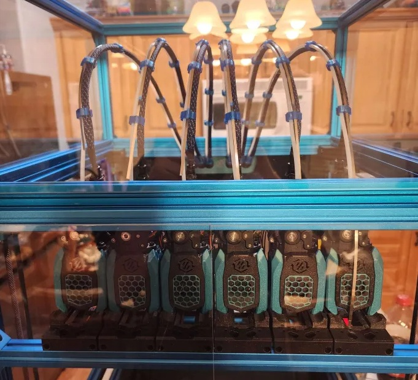
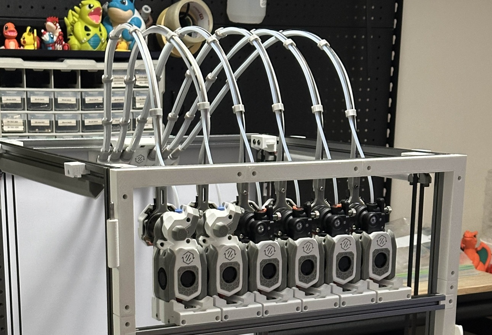

<!-- Use the page layout at TOC.md:  https://github.com/sdylewski/StealthChanger/blob/main/docs/TOC.md -->
# Umbilicals

Each tool uses a separate toolhead PCB that provides power and communication (either via CAN or USB). With several toolheads this quickly adds up in terms of spaghetti and can hook behind the frame or each other, tossing toolheads out of their docks or out of the shuttle if they are not properly managed.

The current recommended option is [Umbilical plates V2](https://github.com/DraftShift/CableManagement/tree/main/UserMods/N3MI-DG/Umbilical_plates_V2) by @N3MI. It replaces the exhaust plate with a plate configured for your specific setup, that way the umbilicals start their journey to the toolhead in the proper arc. A proper arc is necessary to separate each umbilical and prevent yanking the toolhead side to side, which is especially important when the tool gets dropped off into its dock. The umbilical should not yank the toolhead out of its dock or push the toolhead side to side which would misalign its pins with the shuttle and thus fail to pick up.

While piano wire was initially recommended to stiffen the umbilicals and keep its shape into an arc, [3mm x 0.3mm spring steel](https://aliexpress.com/item/1005006731615186.html) works much better at preventing torsion, the umbilicals sways to the side much less, which is very important when the tools are parked close together. Any entanglement will jostle the parked toolheads out of their dock position.

Depending on your toolhead you want to find a cable relief for the umbilical to clamp to. You can terminate the spring steel at the toolhead, resulting in a stiffer arc, but induce more force on the toolhead which might push the nozzle forward or backwards. If you terminate the spring steel above the toolhead the force won't be on the toolhead itself but it might also not be stiff enough to prevent sway.

Tip: heating up the spring steel end with a lighter makes it much more bendable without snapping

## Toolhead cable attachment
Most toolhead boards will have an area to zip-tie your cable to. 
 
* [Umbilical Sock for NiteHawks36](https://github.com/DraftShift/StealthChanger/tree/main/UserMods/Nic335/NH36Sock)

## Length of the umbilical

Depending on your build volume and the chosen toolhead height, the umbilicals will be longer or shorter. For a 350mm they will be around 60-65cm.

A too short umbilical will yank the toolhead back when it's in the bottom corners of the printer. A too long umbilical will push the toolhead forward when it's at the bottom back of the printer. This changes the z-offset of the nozzle and will show up in a bed mesh as either a cliff or a spike. 
Put the toolhead on the shuttle and move the gantry to the furthest position the toolhead has to go, then shorten until it starts yanking, and then lengthen it just enough until it doesn't, that's the minimum length and one that reduces the impact on the toolhead as much as possible

See Cable management for how to manage them at the back of the printer and connect the umbilicals to the host.

## Examples
Here are some examples of how umbilicals should look like, forming an arc and spaced out evenly between the toolheads.

Images by @JDM
 

Image by @Tooks

## Mods

* [N3MI 4-port Exhaust Plate for Stealthchanger with 7 segment LED](https://www.printables.com/model/1452047-n3mi-4-port-exhaust-plate-for-stealthchanger-with)
* (Recommended) [PCB mounts for SHT36 v1, SHT36 v2, SHT36 v3, Nitehawk v1, Nitehawk v2, EBB and CNC HGX Sherpa, Orbitor2 extruders](https://github.com/DraftShift/StealthChanger/tree/main/UserMods/TheSin-/PCB36_Mount)
* [Orbiter V2 BTT EBB36 carrier](https://github.com/DraftShift/StealthChanger/blob/main/UserMods/onsimon/README.md)
* [EBB36 and Galileo 2 Standalone User Mod](https://github.com/DraftShift/StealthChanger/tree/main/UserMods/seenit783)
* [Pcb36 mount for ProtoXtruder 2.0](https://www.printables.com/model/1460801-ebb36-mount-protoextruder2stealthchanger) ([discord link](https://discord.com/channels/1226846451028725821/1373573718017708114))

