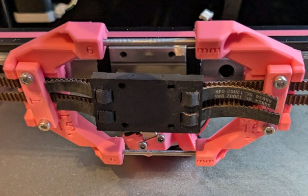

<!-- Use the page layout at TOC.md:  https://github.com/sdylewski/StealthChanger/blob/main/docs/TOC.md -->
# Docks, crossbar, and door buffer

## [Modular Dock](https://github.com/DraftShift/ModularDock/tree/main)
 
[Toolheads](../Toolheads/Toolheads.md) have to sit somewhere when they are not being used to print. The team has created their own dock as a solution. It allows for mounting from both the top bar, as well as a crossbar (or both). Currently all docks used with [Viesturz's Tapchanger](https://github.com/viesturz/tapchanger) are compatible.

### References
* Modular dock: [Draftshift Modular Dock](https://github.com/DraftShift/ModularDock)
* [Modular Dock Assembly Guide](https://github.com/DraftShift/ModularDock/blob/main/Manual/ModularDock_Assembly_Guide.pdf)

## Dock Types

The Modular Dock system offers several dock variants to suit different needs and printer configurations:

### Standard/Long Dock (Official)

Full-height dock with back, base, and vertical front plates. Standard height front plates position the crossbar 170mm below the top extrusion. This is the most common, strongest, and most stable dock type. It works with the default door buffer Z position.

- **Y Build Space Impact**: ~20mm loss
- **Z Height**: 170mm
- **Compatibility**: Works with all toolheads and the default door buffer configuration

### Short Dock (Official)

Dock with shorter Z height (vertical dimension). Short height front plates position the crossbar 130mm below the top extrusion, allowing the crossbar to be mounted higher. This is useful when you need more clearance above the dock. Requires toolhead/extruder/PTFE tube to clear the top frame.

- **Y Build Space Impact**: ~20mm loss (same as standard)
- **Z Height**: 130mm
- **Compatibility**: Works with all toolheads, but **not compatible with the default door buffer** - the door buffer is designed for the standard 170mm Z height

### Stubby Dock (Official)

Shorter dock in Y dimension (depth), using a stubby base instead of the full base. This reduces Y build space loss by approximately half compared to standard docks (~10mm vs ~20mm). **Important**: Stubby docks are only compatible with crossbars mounted between the frame. They are **not compatible with externally-mounted crossbars (door buffer)** because the X carriage cannot reach the shorter docks when the crossbar is mounted externally.

- **Y Build Space Impact**: ~10mm loss (saves 10mm vs standard)
- **Z Height**: Same as standard (170mm)
- **Compatibility**: Not all toolheads support stubby docks - check individual toolhead pages for compatibility. Only works with crossbars mounted between the frame, not with door buffer configurations.

### Crabby Dock (User Mod)

Minimal dock with no vertical supports - just a shaped plate bolted directly to the crossbar. Provides better visibility of toolheads when docked and maximum flexibility in dock positioning. May require additional securing methods (screws with PTFE tubes, magnets) to keep toolheads properly positioned.

- **Y Build Space Impact**: Varies
- **Z Height**: Varies
- **Compatibility**: All crabby docks are user mods, not official Draftshift Design. Not compatible with the default door buffer configuration.

### How many toolheads can I fit?
To calculate how many tools you can fit on the front of your printer you need to know the tools to use first and the amount of room for your front idlers (stock gantry also can't move the entire length of X so make sure you factor that in as well.

   - Remember to leave space between docks for protruding parts and wires. Snagging the neighbouring tool while changing toolheads quickly leads to expensive sounds
   - The gantry requires about 20mm each at max and min X to be able to pass the tools.

**Dock Width Required per Toolhead:**

| Dock Width | Toolheads |
|------------|-----------|
| **60mm** | Anthead, DragonBurner, RapidBurner, MiniSB, Yavoth, SV08 |
| **76mm** | StealthBurner, XOL, A4T, Blackbird, Jabberwocky |

**Note:** Recommend at least 5mm spacing between docks for extruder handles and wires, especially for 60mm toolheads.

### Calculation Formula

1. Measure the front top extrusion inside length
2. Subtract 40mm for front idlers/gantry clearance (this already accounts for spacing at the ends)
3. Calculate available space: `Available Space = Extrusion Length - 40mm`
4. Account for 5mm spacing between each dock (N toolheads = N-1 spaces of 5mm each)
5. Calculate: `Available Space ÷ (Dock Width + 5mm) = Max Toolheads` (round down)

**Formula:** `Max Toolheads = (Extrusion Length - 40mm) ÷ (Dock Width + 5mm)`

**Explanation:** Each toolhead needs its dock width plus 5mm for spacing to the next dock. The last toolhead doesn't need spacing after it, but this formula accounts for that by rounding down.

**Verification:** Ensure `(Toolheads × Dock Width) + ((Toolheads - 1) × 5mm) ≤ (Extrusion Length - 40mm)`

### Examples

| Printer Size | Extrusion Length | Dock Width | Dock Spacing | Max Toolheads | Calculation | Total Used | Remaining Space | Actual Spacing | Notes |
|--------------|------------------|------------|--------------|---------------|-------------|------------|-----------------|----------------|-------|
| Voron 350 | 470mm | 76mm | 5mm | 5 | (470 - 40) ÷ (76 + 5) = 5.31 → 5 | 400mm (5×76 + 4×5) | 30mm | 7.5mm (30 ÷ 4) | 5 tools = 4 spaces, exceeds 5mm minimum |
| Voron 300 | 420mm | 60mm | 5mm | 5 | (420 - 40) ÷ (60 + 5) = 5.85 → 5 | 320mm (5×60 + 4×5) | 60mm | 15mm (60 ÷ 4) | 6 tools would need 385mm (6×60 + 5×5), only 380mm available |
| Voron 250 | 370mm | 60mm | 5mm | 5 | (370 - 40) ÷ (60 + 5) = 5.08 → 5 | 325mm (5×60 + 4×5) | 5mm | 1.25mm (5 ÷ 4) | Very tight spacing, may require modifying extruder tension bolt/spring |

## Crossbar Options
A crossbar is not required, but is strongly recommended for stability. There are multiple options for how to attach it, and each comes with costs and benefits.  You need to pick from one of these options below. 

### Crossbar mounted <em>outside</em> front extrusions

* Probably the most common setup now
* Strongest setup (least dock movement potential)
* Front Idlers do not collide with the crossbar
* Requires a <a href="https://github.com/DraftShift/DoorBuffer">door buffer</a> so your door will still have something flat on the front of the printer
* This option is what comes with the LDO kit
* Another option for new builds is to use 2040 front extrusions, and a fit 2020 crossbar this way on the front part of the verticals.
   * Not recommended as a retrofit. @Sitting.Duc says replacing the front of the frame is not much fun

### Crossbar mounted <em>between</em> front extrusions

* No need for <a href="https://github.com/DraftShift/DoorBuffer">door buffer</a>
* Needs tight bolts or 90° corner brackets to keep from rotating - four corner brackets is best
   * vertical front plates can also help with resisting rotation
* For existing builds with 2020 sides, front idlers will hit the crossbar, so you need to change idlers to use the <a href="https://github.com/DraftShift/StealthChanger/tree/main/UserMods/BT123/MiniBFI%20%2B%20MicroBFI">MiniBFI</a>
* 20mm less Y build space unless you use shorter "stubby" docks, which reduce the loss to 10mm. Not all toolheads appreciate "stubby" docks.
* Any other tips from people who've done this?
* Image from @drakarah with MiniBFI and <a href="https://www.printables.com/model/994635-stealthchanger-stealthburner-minimal-docks-aka-hap/comments">Happy Crab Docks</a>, crossbar held in place with 90deg corner brackets.

#### Mods
   * [Symmetric MiniBFI](https://github.com/DraftShift/StealthChanger/tree/main/UserMods/jimmyjon711/Symmetric%20MiniBFI)

   
### No crossbar and only Top mount

* Least sturdy option
* Requires several printed braces & links to help stabilize the docks
* No need for <a href="https://github.com/DraftShift/DoorBuffer">door buffer</a>
* Generally no collision with front idlers

### Other crossbar mods

* [Monolith crossbar](https://github.com/DraftShift/ModularDock/tree/main/UserMods/MikeYankeeOscarBeta/Monolith_Crossbar)
  
## Crossbar dimensions

#### Crossbar mounted <em>outside</em> front extrusions:

With Doorbuffer adapters you can use the same length as crossbars between the frame (see below), without they need to be a bit larger so you can mount them directly to the frame.  

***NOTE*** For the Mitsumi part numbers below, they are for black annodized, and you will need to drill your own holes 5mm in from the ends (for Voron 2.4).  See the [Door Buffer assembly guide](https://github.com/DraftShift/DoorBuffer/tree/main/Manual) for details.

| Voron Size | Outer Crossbar length | Mitsumi Part |
| ---		|		---				|	---		|
|	250	|  400	| HFSB5-2020-400 |
|	300	|  450	| HFSB5-2020-450 |
|	350	|  500	| HFSB5-2020-500 |

#### Crossbar mounted <em>between</em> front extrusions 
(they are the same length as your frame extrusions):

| Voron Size | Inner Crossbar length | Mitsumi Part |
| ---		|		---				|	---		|
|	250	|	370	| HFSB5-2020-370 | 
|	300	|	420	| HFSB5-2020-420 |
|	350	|	470	| HFSB5-2020-470 |

## Door Buffer

For crossbars mounted outside the front extrusions, you will need to use the door buffer so your door has a flat surface to shut against. There are options for different door types, including Clicky Clacky doors.

### References:
* [DraftShift Door Buffer](https://github.com/DraftShift/DoorBuffer)
* [LDO Door Buffer](https://github.com/MotorDynamicsLab/LDOStealthChanger/blob/master/STLs/Readme.md) is different than the DraftShfit one!

### User Mods:
* [BTT HDMI display mount](https://www.printables.com/model/1419633-btt-hdmi5-v10v12-mount-for-voron-with-clicky-clack) for Clicky Clacky and door buffer
* Door buffer for [2-hinge CNC doors](https://github.com/DraftShift/DoorBuffer/tree/main/UserMods/Dumplap) from CHAOTICLAB
* [Other user mods](https://github.com/DraftShift/DoorBuffer/tree/main/UserMods)

## Other Dock mods
* [Parallel dock for Trident SC](https://github.com/angelassie/Parallel-Dock-for-Trident-Stealthchanger)
* [Screw docks](https://www.printables.com/model/911717-stealthchanger-screw-docks) (for hooking toolheads) ([discord link](https://discord.com/channels/1226846451028725821/1244583842841362493))
  
## FAQ

**Quick Links:**
- [Moving from and to the dock is so slow](#moving-from-and-to-the-dock-is-so-slow)
- [I can't get past 50mm/s Z velocity](#i-cant-seem-to-get-past-50mms-z-velocity-before-it-makes-really-angry-noises-and-skips-steps)
- [I can't get my tools to sit flush](#i-cant-seem-to-get-my-tools-to-sit-flush)
- [My tool is going straight into the dock](#my-tool-is-going-straight-into-the-dock-i-had-to-emergency-stop)
- [I can't get my crossbar between my frame](#i-cant-for-the-life-of-me-get-my-crossbar-between-my-frame)

---

### Moving from and to the dock is so slow
You can increase the printer Z speed `max_z_velocity` and acceleration `max_z_accel`, depending on your motors, motor drivers. It's recommended to increase this in small steps because lost steps due to a loose belt will violently skew the gantry and might break your motor mounts.
For example 24V moons motors with TMC2209 drivers can reliably get `max_z_velocity: 200` and `max_z_accel: 750` if the rest of the hardware is fine, that speed reduces dropoff/pickup to ~10seconds.

### I can't seem to get past 50mm/s Z velocity before it makes really angry noises and skips steps
Make sure you have [StealthChop](https://www.klipper3d.org/TMC_Drivers.html#setting-spreadcycle-vs-stealthchop-mode) disabled on all of the Z motors. Spreadcycle is louder but gives much more torque that's required to run the Z velocity at a higher speed

If you have [TMC autotune](https://github.com/andrewmcgr/klipper_tmc_autotune), make sure to set the Z motors profile to `performance`, by default Z motors will be on the silent profile.

### I can't seem to get my tools to sit flush
Make sure your nozzle blocker cup isn't pushing the tool out of its flush position, ideally retract the cup as far as possible, then make sure the tool sits flush by adjusting the back of the dock, then slowly raise the cup until it touches the nozzle without putting force on the toolhead. If your dock/toolhead has magnets, make sure the magnets are inserted deeply enough and sit flush.

### My tool is going straight into the dock, I had to emergency stop
Make sure the `[rounded_path]` is added to your printer cfg, without it it will ignore the rounded paths in the pickup/dropoff sequence and go straight to the pickup position and the dock will be in the way.

### I can't for the life of me get my crossbar between my frame
Loosen the frame bolt at one corner a bit so you have more play and slide it into position, then tighten the frame again

### I don't want to tap and drill holes for my crossbar, do I need to?
For a crossbar between the frame you can use 90 degree corner brackets to mount it, these will also prevent the crossbar from rotating. Consider using four corner brackets: two above and two below the crossbar, for greater rigidity. For a crossbar outside the frame you can use the Doorbuffer adapters.

### How high should I mount the crossbar?
That depends, with DoorBuffer you have a fixed height (unless you modify the CAD). Between the frame if you use the top parts to mount the docks to the top frame that will also determine the crossbar position. With crabby/one piece docks that only mount to the crossbar you have more freedom and it will depend on the height of your tallest toolhead + some margin to pick up the tool from out of the dock.

 * If you use standard height front-plates, the crossbar will be 170mm below the top extrusion.
 * If you use short height front-plates, the crossbar will be 130mm below the top extrusion.
 * If you do not want/need vertical front-plates, you have much more freedom to place the crossbar

### Do I need to disassemble the whole gantry to install MiniBFI?
Thankfully no, your gantry can stay in place, you just need to disconnect the front Z belts and AB belts, replace the idlers, route the belts and tighten everything up. Do one side at a time, that will keep the gantry hanging. You can support the gantry with a stack of books.

### I installed MiniBFI but I don't have enough margin to tension the belts correctly
Make sure you keep tension in the belts while installing the shuttle with the [belt helper](https://github.com/DraftShift/StealthChanger/tree/main/STLs/Extras/BeltHelper)

### Can Y be negative to reach the docks?
Yes, in fact it will be in its recommended configuration. Keep 0,0 as the left, front corner of the bed by adjusting the max X and max Y. Having 0,0 as a bed corner makes it a lot more straightforward in the slicer and makes coordinates more intuitive ("anything between 0-350 is on the bed" for a 350 printer). To reach the parking position in the docks the toolhead will have to travel beyond the bed, so park Y will be negative. Note that if you move the bed and adjust the 0,0 point you will have to update all the dock positions with the same delta change, as well as any coordinates you are using in macros for e.g. wipers, sexball, etc.

