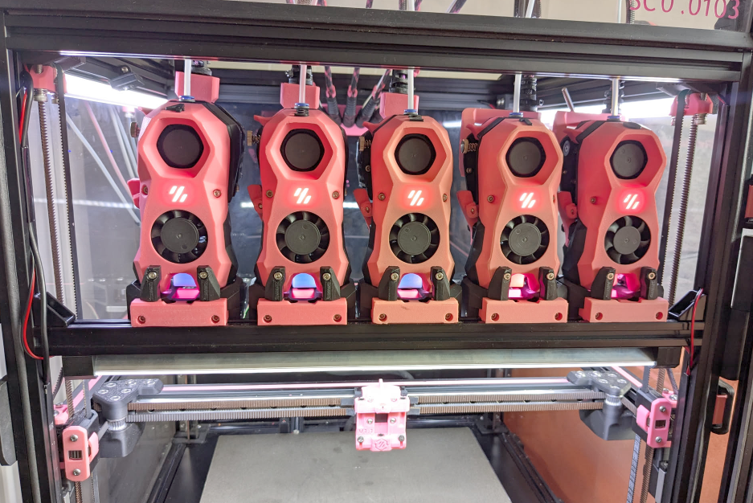

<!-- Use the page layout at TOC.md:  https://github.com/sdylewski/StealthChanger/blob/main/docs/TOC.md -->
# Docks, crossbar, and door buffer

## Modular Dock
 
The team has created their own dock as a solution. It allows for mounting from both the top bar, as well as a crossbar (or both). Currently all docks used with [Viesturz's Tapchanger](https://github.com/viesturz/tapchanger) are compatible.

### References
* Modular dock: [Draftshift Modular Dock](https://github.com/DraftShift/ModularDock">Draftshift Modular Dock)
* [Modular Dock Assembly Guide](https://github.com/DraftShift/ModularDock/blob/main/Manual/ModularDock_Assembly_Guide.pdf)

### How many toolheads can I fit?
To calculate how many tools you can fit on the front of your printer you ened to know the tools to use first and the amount of room for your front idlers (stock gantry also can't move the entire length of X so make sure you factor that in as well.

   - Dragon Burners/Yavoth require 60mm per tool (I recommend 5mm between for extruder handles)
   - Blackbird, Stealth Burners and XOL require 76mm per tool
   - The gantry required about 20mm per side to be able to pass the tools.  To know how many tools you can fit it's simple math, measure that top bar -40mm to gantry and then divide the remainder by the size of your toolhead.

Once you have this add it all up and subtracked the length of your front extrusion.

Example: Voron 350 is 470mm total, 5 stealthburners is 76 x 5 = 380 -> 380 + 40 - 470 = 50, so that means you can fit 5 Stealthburners and have 50mm to spare which is not enoguh for any other tools.

## Crossbar Options
A crossbar is recommended for stability, but there are options for how to mount it, and then that enables/disables other things.  You need to pick one of these options below.  For for more details, see the [crossbar](crossbar.md) page.

<table>
<tr><th>Crossbar options</th><th>Example</th></tr>

<tr><td><h3>Crossbar mounted <em>outside</em> front extrusions</h3>
	<ul><li>Probably the most common setup</li>
	<li>Strongest setup (least dock movement potential)</li>
	<li>Requires a <a href="https://github.com/DraftShift/DoorBuffer">door buffer</a> so your door will still have something flat on the front of the printer</li>
	<li>This option is what comes with the LDO kit</li>
	</ul></td>
	<td valign="top"></td></tr>

<tr><td><h3>Crossbar mounted <em>between</em> front extrusions</h3>
			<ul><li>No need for <a href="https://github.com/DraftShift/DoorBuffer">door buffer</a></li>
         <li>Needs tight bolts to keep from rotating</li>
         <li>An other tips from people who've done this?</li>
         <li>For existing builds with 2020 sides, front idlers will hit the crossbar, so you need to change idlers to use the <a href="https://github.com/DraftShift/StealthChanger/tree/main/UserMods/BT123/MiniBFI%20%2B%20MicroBFI">MiniBFI</a>.</li>
			<li>20mm less Y build space unless you use shorter "stubby" docks.  Even with stubby docks, the Y build space is 10mm less than the outside-mounted crossbar?</li>
         <li>Another option for new builds is to use 2040 front extrusions, and a 2020 crossbar this way.</li>
			<li>Image from @drakarah and <a href="https://www.printables.com/model/994635-stealthchanger-stealthburner-minimal-docks-aka-hap/comments">Happy Crab Docks</a></li>
		</ul></td><td valign="top"></td></tr>
   
   <tr><td><h3>No crossbar / Top mount</h3>
			<ul><li>Least sturdy option</li>
			<li>Requires several printed braces & links to help stabilize the docks</li>
			<li>No need for <a href="https://github.com/DraftShift/DoorBuffer">door buffer</a>?</li>
		</ul></td>
		<td valign="top">
		</td></tr>
</table>

### Crossbar dimensions

Crossbar mounted <em>outside</em> front extrusions:

| Voron Size | Outer Crossbar length | Mitsumi link |
| ---		|		---				|	---		|
|	250	|		|
|	300	|		|
|	350	|		|

Crossbar mounted <em>between</em> front extrusions:

| Voron Size | Inner Crossbar length | Mitsumi link |
| ---		|		---				|	---		|
|	250	|		|
|	300	|		|
|	350	|		|

## Door Buffer

For crossbars mounted outside the front extrusions, you need to use the door buffer so your door will shut against something flat. There are options for different door types, including Clicky Clacky doors.

### References:
* [DraftShift Door Buffer](https://github.com/DraftShift/DoorBuffer)

### User Mods:
* [BTT HDMI display mount](https://www.printables.com/model/1419633-btt-hdmi5-v10v12-mount-for-voron-with-clicky-clack) for Clicky Clacky and door buffer
* Door buffer for [2-hinge CNC doors](https://github.com/DraftShift/DoorBuffer/tree/main/UserMods/Dumplap) from CHAOTICLAB
* [Other user mods](https://github.com/DraftShift/DoorBuffer/tree/main/UserMods)
