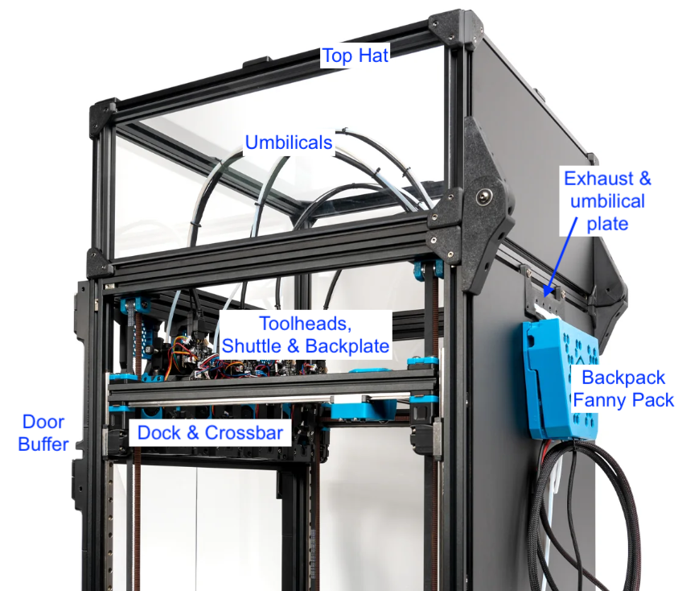

<!-- Use the page layout at TOC.md:  https://github.com/sdylewski/StealthChanger/blob/main/docs/TOC.md -->

# Electronics & Cable Mangement
Lots of toolheads mean lots of extra wires and filament that needs to be managed properly. With the umbilicals going to the exhaust port there are several options to connect them and to clean up the bundle with a "backpack" mounted on the back of the printer.

## Components
* [Backpack](#Backpack) - holds any power and data distribution boards 
* [Umbilical Plate](Umbilicals.md) - holds one end of the umbilical while allowing wiring and filament to pass through
* [Umbilicals](Umbilicals.md) - Wiring harness going to toolhead
* Power Requirements - Make sure you're getting enough power.
* Filament management - Options for how to manage 2-6 spools.

## Bowden tube routing
Depending on where you have your filament spools https://github.com/DraftShift/CableManagement/tree/main/UserMods/N3MI-DG/Filament_Entry can be useful to clean up the bowden tube paths.

## CAN termination layout and common issues

Unless the toolheads are daisy chained together the CAN bus is more of a CAN star network. That is out of spec but is usually fine. Terminate the CAN bus with 2 termination resistors (usually you have jumpers for that) as usual, one on the main board, one on one of the toolheads. Omit the jumper on the rest of the toolheads to prevent reducing the resistance between CAN L and CAN H.

If you have SB2209s however you might need to add more termination resistors. Add one termination resistor at the time and test if all the boards get picked up, if not add more or move them around, it's unclear what's causing the SB2209 to be more sensitive to reflections, other boards don't have this issue.

Other common issues are usually resolved by going through Esotericals CAN guide https://canbus.esoterical.online/, it's the same process for each toolhead.

