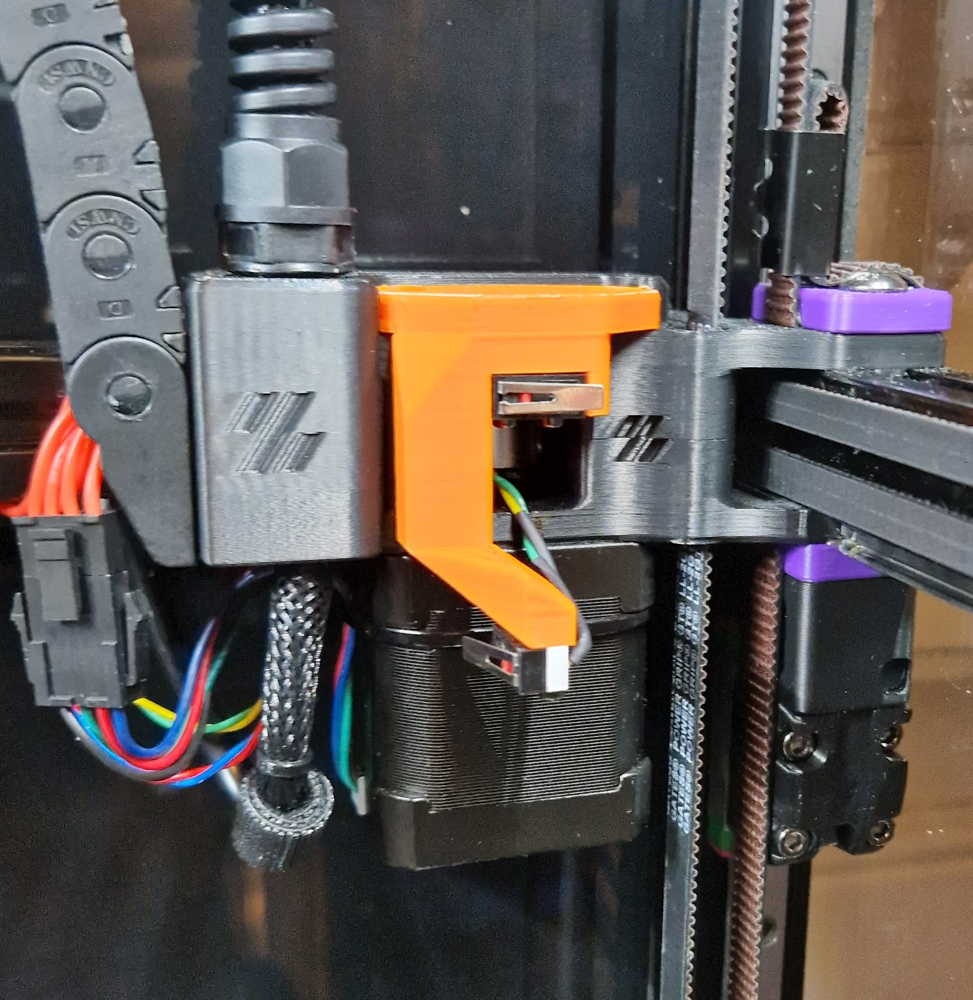

<!-- Use the page layout at TOC.md:  https://github.com/sdylewski/StealthChanger/blob/main/docs/TOC.md -->
<!-- This page has the liquid html rendering image off so the gcode renders properly -->

# XY Endstops

The gantry needs to home its X and Y position, preferably with repeated accuracy as the X,Y position becomes important to pick up and drop off toolheads properly.

The X endstop on a toolhead will no longer work so that needs to be relocated or discarded altogether. The rise in popularity of Beacon/Carto/etc on the Shuttle with a second umbilical means an X endstop on the shuttle may be viable, just fiddly.

# Options

## Sensorless homing

Most common, easiest, just fiddly to get right, especially with TMC5160 drivers. It's easier to get X working first, and use a microswitch for Y.

[https://docs.vorondesign.com/tuning/sensorless.html](https://docs.vorondesign.com/tuning/sensorless.html)


## Relocation mod
This moves X and Y endstops to the motor mount, there are a couple of options:
(show pictures of each?)

### [Endstop mounts for printed and CNC shuttle (N3MI)](https://github.com/DraftShift/StealthChanger/tree/main/UserMods/N3MI-DG/Endstop_Mounts)
[](https://github.com/DraftShift/StealthChanger/tree/main/UserMods/N3MI-DG/Endstop_Mounts)

Relocates the X and Y endstop switches to the A motor

### [DraftShift Design](https://github.com/DraftShift/StealthChanger/tree/main/STLs/Endstops)
[](https://github.com/DraftShift/StealthChanger/tree/main/STLs/Endstops)

Relocates the X and Y endstop switches to the A motor 

### [Endstop by Vin-Y](https://github.com/DraftShift/StealthChanger/tree/main/UserMods/VIN-y/Endstops)
[](https://github.com/DraftShift/StealthChanger/tree/main/UserMods/VIN-y/Endstops)

Relocates the X and Y endstop switches to the A motor

## Hall-Effect
Each of the above examples uses a mechanical switch, it is possible to use hall-effect endstops instead, although fewer pre-made UserMods for that exist
  
## Endstop repeatability macro 
By @Contomo

Run with `TEST_ENDSTOP_REPEATABILITY AXIS=X`

<!-- raw / endraw is needed to render the html correctly -->

```
[gcode_macro TEST_ENDSTOP_REPEATABILITY]
variable_cache: {}
gcode:
    
    
    

    
        { action_respond_info("AXIS must be X, Y or Z") }
    
        { action_respond_info("CYCLES must be ≥ 2") }
    
        
        SET_GCODE_VARIABLE MACRO=TEST_ENDSTOP_REPEATABILITY VARIABLE=cache VALUE="{ { 'name': step_name, 'l': [] } }"
        
        { action_respond_info("Running test on %s-axis — %d cycles, retract %.2f mm" % (axis, cycles, retract)) }
        
            G28 {axis}
            M400
            _TEST_ENDSTOP_REPEATABILITY RECORD={axis}
            G91
            G0 {axis}{sign}{retract}      ; relative retract
            G90
            M400
            G4 P100
        
        _TEST_ENDSTOP_REPEATABILITY PROCESS={axis}
    
```


Depending on how strong the umbilical affects the toolhead in the corners, it might be more accurate to return to the center position before homing the other axis, that way the homing is always done in the middle of the gantry and any effect of umbilicals or gantry being racked does not affect the homing precision.


## FAQ

### How do I get my sensorless endstops to work
[https://docs.vorondesign.com/tuning/sensorless.html](https://docs.vorondesign.com/tuning/sensorless.html)

Note for greatest reliability, you can use GET_POSITION to check for lost steps.
<!-- raw / endraw is needed to render the html correctly -->

```
G28
G0 X175 Y175
GET_POSITION
G28
G0 X175 Y175
GET_POSITION
```


If, for example, you have 32 microsteps, and the first line returned by GET_POSITION (such as `stepper_x:-301 stepper_y:297 stepper_z:88 stepper_z1:98 stepper_z2:68 stepper_z3:78`) differs by more than 32 values from the second set of values, then your sensorless homing needs more tuning

### What about Z Offset?
Has an entire section [Probes](Probes.md) to cover Homing Z, finding a Z Offset for the first tool, and then finding differences between tools.

