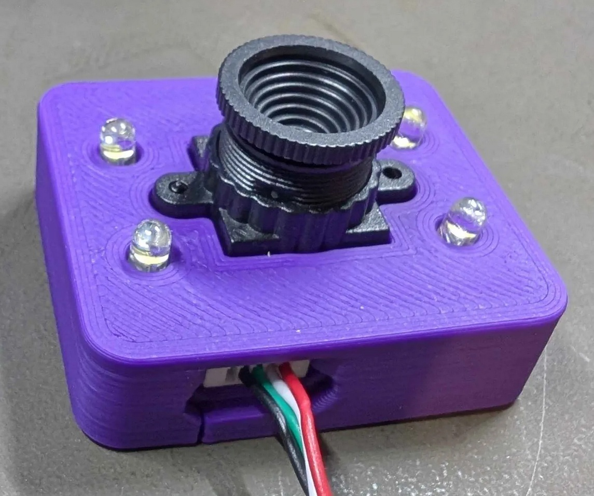
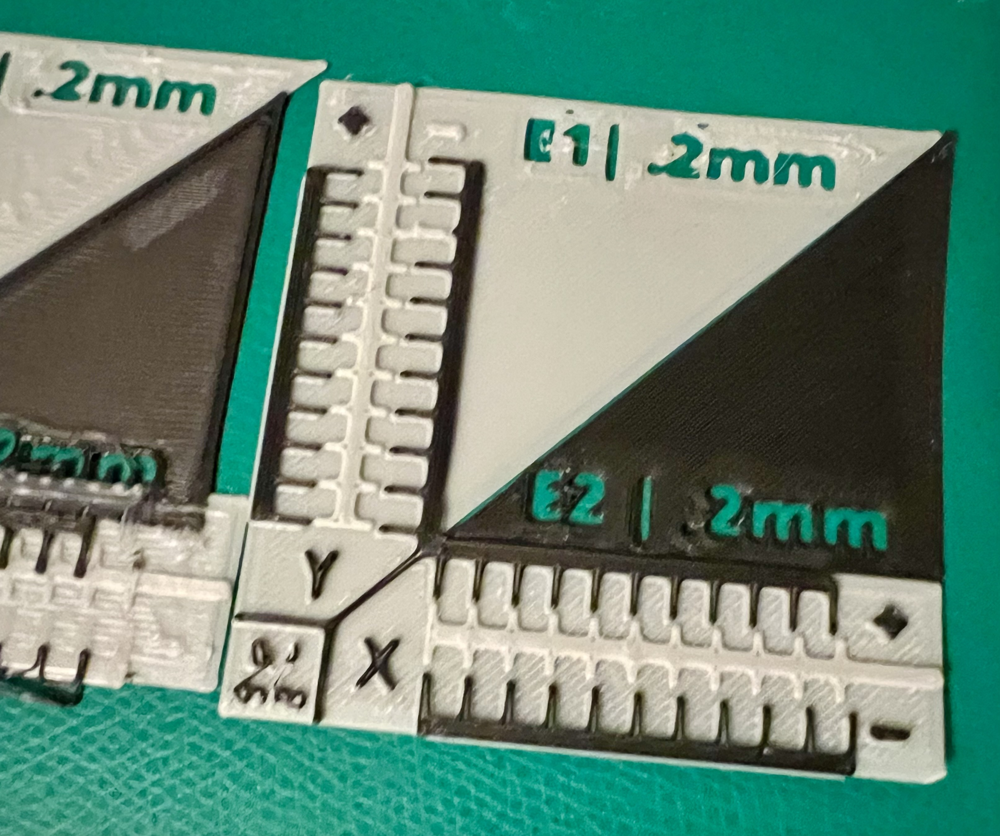

<!-- Use the page layout at TOC.md:  https://github.com/sdylewski/StealthChanger/blob/main/docs/TOC.md -->
# Probes
There are 2 types of probes used in StealthChanger. One is the familiar Z-probe to do Z homing and find the bed position at Z=0 (along with `z-offset`, the distance from the bed to the trigger point of the probe). The other is used for inter-tool offsets (`gcode_offset` in `[tool]` section), as each nozzle will be ever so slightly different in terms of X,Y,Z position, the offsets relative to the first tool (T0) have to be taken into account so the printer prints in the expected location after a tool swap.

## 1. Z-probes

### TAP
Each toolhead of Stealthchanger has a OctoTap PCB board: required for detecting which tool is active on the shuttle and whether the pickup of a new tool has succeeded. Since it is required anyway, this can also be used for homing with the nozzle just like Voron TAP. Even if you use a different z-probe, you still need an OctoTap PCB per toolhead.
Note that the z-offset will be negative for TAP as the motors will continue to go below the zero (= bed level) point to trigger the OctoTap sensor by pushing the toolhead up out of the shuttle until it triggers the OctoTap. Since the trigger is after the nozzle contacts the bed, the z-offset is negative. Simple.

Installing a wiper near the bed and have a CLEAN_NOZZLE macro after the initial home and before QGL and re-home is recommended, any leftover filament will throw off gantry levelling and actual bed height.

This is the default way how StealthChanger homes and QGLs.

Pro: 
 * You already have the OctoTAPs to detect which tool is active so it's basically free
 * Accurate enough *if* your nozzle is clean

Con:
 * Does not allow for toolless homing, a tool needs to be present on the shuttle to home
 * Is pretty slow, especially for QGL and large bed meshes
 * Can dimple the PEI plate, especially a smooth one if you use N52 magnets in the shuttle and backplate
   
### Beacon/Carto
A magnetic field sensor that can detect the metal of the build plate without contacting it, and also while the toolhead is moving.

Pro:
 * Toolless homing
 * Much faster than TAP

Con:
 * (Klipper does not tolerate the sensor PCB appearing/disappearing at runtime, so either one per tool ($$$) or shuttle mount)
 * Requires an extra umbilical to the shuttle
 * Not all variants are stable across temperatures, especially for elevated chambers (read, fancy filaments)

#### Mounts
* [Carto mounts for CNC shuttles](https://github.com/DraftShift/StealthChanger/tree/main/UserMods/N3MI-DG/Carto_Mounts)
* [Beacon/Carto Mount for Fystec/LDO CNC Shuttle with Top Brace](https://github.com/DraftShift/StealthChanger/tree/main/UserMods/cekim-git/CNCShuttleMount/)

### Eddy
// TODO

## 2. Inter tool offset calibration probes
(note that buying hardware is not required, you can calibrate X, Y and even Z just by printing reference plates. But buying / building a dedicated calibration probe will generally yield better results, faster and with less colourful language. Details below:)

### Sexball
A sexball is a mod of [sexbolt](https://mods.vorondesign.com/details/t1DBVlcUBbdEK6habEsVzg) that replaces the flat top with a ball. This allows the tool calibration to self center with a nozzle by [probing](https://www.youtube.com/watch?v=gKaL7Oxud2c) the ball on each side until it triggers. By having a common center point the nozzle X,Y,Z offsets of each tool relative to a tool (T0) can be determined. These are the `gcode_offset` you need to save in `[tool]` so they can be applied after a tool is swapped out. That way the 

Image By asoli
 

Pro:
 * Easy to set up though you might need to move the bed a bit so all of the tools can reach the sexball from each side
 * Offers X,Y and Z offset calibration - now with handy scripts
   
Con:
 * Requires 6mm of travel past the centre of the bolt on all four sides, which can limit valid mounting locations
 * Relies on a physical contact, which means this requires tight tolerances: the sexball shouldn't have any play. The toolhead nozzles should also be concentric (the bore hole has to be in the exact middle of the nozzle), cheap nozzles often aren't, which means the determined offsets be inaccurate due to a a bias
 * Pushes sideways on a sphere to generate vertical movement, so that can go wrong

See [tool calibration configuration](https://github.com/viesturz/klipper-toolchanger/blob/main/tools_calibrate.md) to set up calibration config and macros.

#### BOM
Calibration probe option that just replaces the shaft on a sexbolt.
- [Probe](https://s.click.aliexpress.com/e/_oB1egOH)
- [12mm Ball with M5 Threads](https://s.click.aliexpress.com/e/_o2DGfvf)
- [M5x30mm External Thread Pin](https://s.click.aliexpress.com/e/_omw2qxX)

**NOTE:** For micron M5x25mm Pin is tall enough
**NOTE:** Only use the hartk style bodies with the sleeves, knockoffs have too much slop.

 Image by BT123

#### Affiliate Links

| Parts   	  | Link 1     | Link 2    | Link 3    |
|-----------  |------------|-----------|-----------|
| Bushing 	  | [AliExpress](https://s.click.aliexpress.com/e/_Dmsh3LJ) | [US Amazon](https://amzn.to/3RAjKtY) | [UK Amazon](https://amzn.to/48jnoPO) | 
| Pin     	  | [AliExpress](https://s.click.aliexpress.com/e/_DCQkrFP) | [US Amazon](https://amzn.to/3GZBSZn) | [UK Amazon](https://amzn.to/488gP2v) |

Due to QC issues, this is an [Alternative bushing](https://s.click.aliexpress.com/e/_DFJQgtN) which has also been tested and works fine.

Alternatively you can purchase check on our official [vendors list](Building/Vendors-and-Kits.md)

#### Mods

* [Sexball top mount](https://github.com/DraftShift/StealthChanger/tree/main/UserMods/Dumplap/SexBolt%202020%20Top%20Mount)
* [Sexball rest mount](https://www.printables.com/model/1094209-sexball-probe-rest-mount-for-stealthchanger-calibr)
* [Alternative with 4mm dowels instead of ball](https://www.printables.com/model/1073728-shorter-multi-tool-calibration-probe-with-4mm-dowe) ([discord link](https://discord.com/channels/1226846451028725821/1306506750509449258))

### [Axiscope](https://github.com/nic335/Axiscope)
[Axiscope](https://github.com/nic335/Axiscope) uses a camera instead of a physical probe to align each toolhead nozzle. With its provided web interface it's really easy to go through the toolheads, align them and determine the offsets. It also supports a physical endstop to determine the gcode Z offsets (make sure your nozzle is clean).

<table>
<tr>
 <td></td>
 <td></td>
</tr>
 <tr><td colspan="2">Images from <a href="https://www.printables.com/model/1099576-xy-nozzle-alignment-camera">printables</a></td></tr>
</table>

Pro:
 * Visual approach, which eliminates potential tolerance issues and inaccuracies in (cheap) nozzles
 * You inspect the nozzle with a close up, detecting potential issues (such as filament stuck throwing off Z)
   
Con: 
 * A bit more manual work to align the nozzles manually (but not more than a couple of minutes)
 * Gcode Z offset still requires an endstop, it also requires you to set X,Y gcode offsets before calibrating Z (so the endstop is pushed at the exact sample place with each nozzle)  

The USB cable of the camera is not very long, you might want to consider adding a [USB keystone insert](https://www.printables.com/model/609433-voron-skirt-keystone-for-usbethernet) at the front to plug it in more easily.

#### BOM
 - OV9726 camera module
 - 5V 3mm round white6000-6500k LEDS x 4
 - [3D printed camera module holder](https://www.printables.com/model/1099576-xy-nozzle-alignment-camera)
   
### [Nudge](https://github.com/zruncho3d/nudge)
 Image from Nudge site.

A buildable probe. A vertical pole that is held against a series of bolts by spring tension completing a circuit. Any push on the top of the pole breaks the circuit at the bottom of the pole, registering the contact

// see calibration section for how to use it

Pro:
 * Mostly 3d printed, using parts many of us have laying about
 * Less translation of horizontal motion to vertical thrust as compared to Sexball

Con:
 * Requires tuning to avoid driving the pole too far in Z and jamming the mechanism
 * Consider using Copper SHCS Screws: @MajorHack built one with SS screws that didn't work

#### Mods

* [2.4 Dockable Nudge Mount](https://github.com/DraftShift/StealthChanger/tree/main/UserMods/MRSalguod/2.4%20Dockable%20Nudge%20Mount)

### Using a printable calibration
You don't need extra hardware to do a proper tool offset calibration, you can print a calibration print, it's just a lot more work. If you don't know your gcode_z_offsets, then make sure your nozzles gcode_z_offsets are somewhat high enough before you print or all the tools that have lower nozzles than T0 will dig into the bed!
 

There are a few different printable XY calibration methods that work well: 

* [X, Y and Z calibration tool for IDEX](https://www.printables.com/model/201707-x-y-and-z-calibration-tool-for-idex-dual-extruder)

Pro: 
 - Visual approach, what you see is what you're going to get

Con:
 - It's a ton of work to calibrate a single toolhead this way, let alone 5 or 6.
 - A bad gcode Z offset is going to dig into your bed and damage your PEI plate.
   
# FAQ

### My sexball probe doesn't work, it's always triggered
If you're using sensorless homing you have set the diag jumper to detect a stall. Make sure to plug endstops or other micro switches into endstop ports that do not share the pins with the corresponding motor diag pin, e.g. one that corresponds with the Z motors. Check your mainboard manual which ports match which motors.

### My OctoTAP board doesn't trigger reliably
1. Make sure your OctoTAP PCB is mounted as low as possible, or it might not be triggered by the shuttle flag. Push it down and then tighten the screws, depending on the board there is some play in the screw holes causing it to sit higher than it should.
2. Make sure the optical sensor on the board is straight, some boards have the optical sensor bent and not perpendicular with the board

### Do I need to cut the trace on the OctoTAP board?
Generally not, if you supply it 5v from the toolhead board it should work just fine. The trace is to cut out the 24v -> 5v linear regulator in case that interferes but that also means your board is now 5v only.

### Can I still use `SAVE_CONFIG` after `PROBE`?
No, `SAVE_CONFIG` will save your z-offset at the bottom of your printer.cfg, not in the tool probe section of the tool that's active, it won't be applied if you do. The z-offset is fetched from the tool that's homing and applied in homing_override. 

### My Nudge reports "endstop triggered before contact"
Bad electrical connections. You need to use copper SHCS at least.  Check the resistance between the two output pins.

### Do I need to calibrate the offsets on every print?
No, the offsets should remain the same unless you change something hardware related, like disassembling and reassembling a toolhead, changing the preload screws on its backplate, swapping out a nozzle, etc. Basically anything that can move a nozzle in a different location. It's a good idea to check the offsets periodically to make sure there's no drift, especially before a long multicolor print to ensure the best quality.

