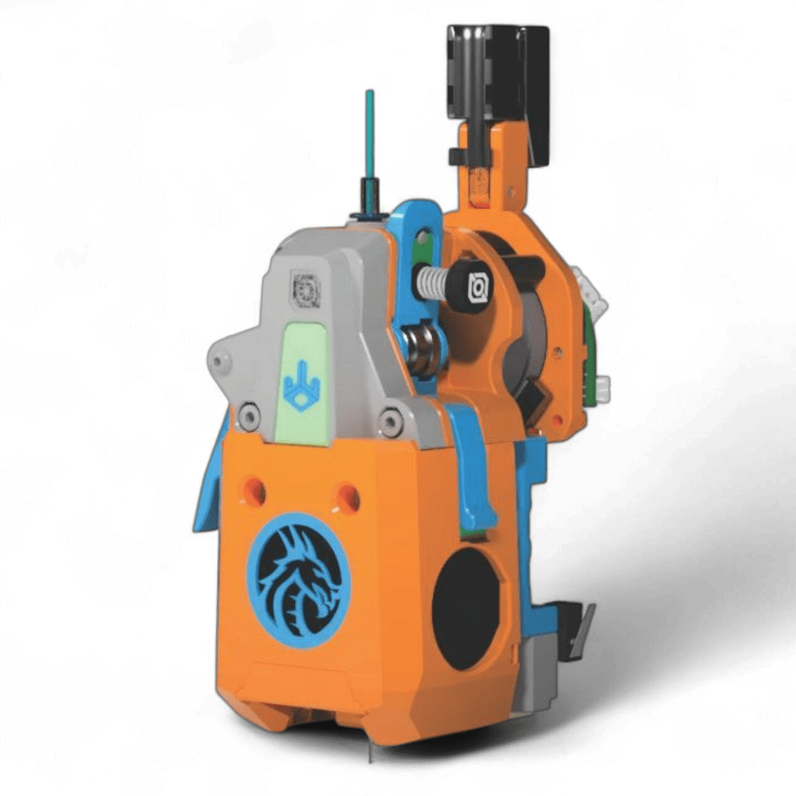

# Jabberwocky

## References

* [Jabberwocky Reference Page](https://github.com/kinematicdigit/Jabberwocky)

## Backplate

* [Jabberwocky Backplate](https://github.com/sdylewski/StealthChanger/blob/main/STLs/Backplates)

### Backplate BOM for All Tools

- [4] m3 heat inserts
- [3] Ø4x12mm ssRod (dowel pin) with a rounded end **(if it has female threads on the back it will be listed as an M3, but make sure the pin is 4mm OD, that is what is important. We recommend the threaded pins for better fixing)**
- [1] 6x3mm magnet (N52 Highly recommended to counter the pull from the umbilicals. Note that most magnets not from a reputable source may say N52 but aren't actually. Recommend one of the two links below.)
- [2] m3x6 or m3x8 FHCS (Flat head countersunk screw, MUST BE MAGNETIC. no stainless, as per TAP)
- [1] [OptoTap](https://s.click.aliexpress.com/e/_DEGsGTV) (only the sensor PCB is required)
- [1] m3x8 BHCS (optional in v1.1)

### BOM Additions for Jabberwocky

* TBD

## PCB Mounting Options

### Official PCB Mounts (Draftshift Design)

*No official PCB mounts from Draftshift Design. See User Mods below.*

### User Mods

*No user mod PCB mounts documented yet. Check the [StealthChanger UserMods](https://github.com/DraftShift/StealthChanger/tree/main/UserMods) directory for community contributions.*

## Toolhead Options & Mods

* TBD

## Dock

| Dock Width | Stubby Dock Compatible |
|------------|------------------------|
| 76mm | ❌ No |

### Maximum Toolheads per Printer Size

| Printer Size | Max Toolheads |
|--------------|---------------|
| Voron 250 | 4 |
| Voron 300 | 4 |
| Voron 350 | 5 |

*Calculation assumes 5mm spacing between docks. See [Docks](../Docks.md) for details.*

### Official Dock Types (Draftshift Design)

| Dock Type | Description | Link |
|-----------|-------------|------|
| Standard Dock | Full-height dock with back and base | [Jabberwocky Back and Base](https://github.com/DraftShift/ModularDock/tree/main/STLs/Jabberwocky) |

**Note:** Jabberwocky is not compatible with stubby docks due to toolhead geometry.

### User Mods

*No user mod docks documented yet. Check the [ModularDock UserMods](https://github.com/DraftShift/ModularDock/tree/main/UserMods) directory for community contributions.*

**Additional Resources:**
* Common components for [your dock type](../Docks.md)
* [Modular dock assembly guide](https://github.com/DraftShift/ModularDock/blob/main/Manual/ModularDock_Assembly_Guide.pdf)

## Tips & Suggestions
* TBD
