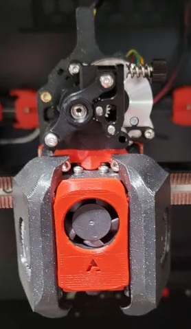
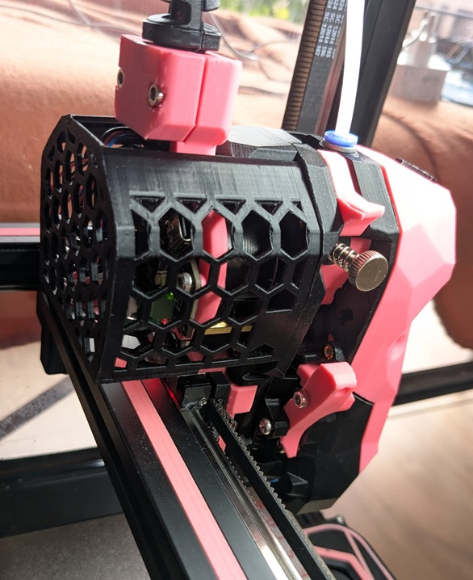

<!-- Use the page layout at TOC.md:  https://github.com/sdylewski/StealthChanger/blob/main/docs/TOC.md -->
# Toolheads

Many of the most common toolheads are supported.  You may build a dock for your existing toolhead, and then built new toolheads as other types. You can mix and match, but the configs get more complicated because you need to have different ones for each toolhead. 

Note that toolheads go hand-in-hand with their associated docks, and the options/mods available for them. 

Each toolhead page will contain specifics for the backplate, dock, and modifications for that toolhead.

## [Anthead](Anthead.md)

* Uses 60mm wide docks
* Can use stubby docks? 
* Default cowl and dock has built-in magnet holes for better docking

## [A4T](A4T.md)

* Uses XX wide docks
* Requires Shorter Z joints like <a href="https://github.com/VoronDesign/VoronUsers/tree/main/printer_mods/hartk1213/Voron2.4_GE5C">Ge5C z-joints</a> so you don't bottom out your carriage when homing.
* Requires new smaller front idlers like the <a href="https://github.com/clee/VoronBFI">BFI</a> or <a href="https://github.com/DraftShift/StealthChanger/tree/main/UserMods/BT123/MiniBFI%20%2B%20MicroBFI">Mini BFI</a>

	
## [Dragonburner & Rapidburner](Dragonburner.md)

* Uses 60mm wide docks.
* Can use stubby docks.

## [Stealthburner](Stealthburner.md)

* 76mm wide dock
* Docking is a bit harder? 
		
## [SV08](SV08.md)

		
## [XOL](XOL.md)

* 76mm wide dock

## [Yavoth](Yavoth.md)

* 60mm wide dock

## [Mini StealthBurner](MiniSB.md)

* 60mm wide dock

## [Blackbird](Blackbird.md)

* 76mm wide dock

## Selecting a new toolhead?

### Toolheads
* [Awesome-Toolheads](https://github.com/SartorialGrunt0/Awesome-Toolheads?tab=readme-ov-file)
* [Toolhead comparison](https://3dp-info.fyi/toolhead-comparison)

### Extruders
* [Awesome-Extruders](https://github.com/SartorialGrunt0/Awesome-Toolheads?tab=readme-ov-file)
* [Extruder comparision](https://3dp-info.fyi/extruder-comparison)

### Hotends
* TBD

# Toolheads FAQ

### Can I mix and match different toolheads and hotends?
Yes to a certain degree. The parking position of the various toolheads has to be more or less the same, if one toolhead is significantly higher or lower then the gantry will bump into the pins of its backplate when trying to pick up other tools. You would need to add dock spacers to ensure that all the pins of each backplate are somewhat on the same height. Calibration for things like pressure advance is also more difficult, but possible.

### What about different hotends that have higher/lower flow rates
Yes, you would need to configure that in your slicer per extruder. If you can't you would need to make a filament profile per extruder (PLA - T0, PLA - T1) and configure it that way, assigning the correct filament profile to the right tool.

### What about different nozzle sizes?
Yes, if your slicer supports it. Orca slicer does.

### What is ooze prevention and pre-heating
Orca slicer has a feature to prevent oozing of tools that are actively being used, by dropping their temperature to an idle temperature. It also can ramp up the temperature back up by a set amount of seconds before the tool is actually being called to make sure the toolhead is ready to go without waiting. This also has the added benefit of not cooking your filament for long periods of time and preventing heat creep, so it's definitely recommended.
(add link for how to enable)

### It picks up the tool and then waits for a long time before continuing
This is likely Klipper waiting for the temperature of the hotend to settle to the target temperature. If your hotend is not well PID tuned it can sometimes oscillate indefinitely around the target temperature. By default this margin is quite small, only 0.5°C. This is usually not a problem for single toolhead printers as your hotend only heats up once, but with a toolchanger where it heats up the tool every tool call this can introduce a lot of delay. Depending on your klipper-toolchanger version you can mitigate this by increasing the deadband, the amount of °C around the target temperature that is considered "good enough to continue".

### The wires of my toolboard get snagged when doing a tool change
Either shorten your wires, tuck them away with zip ties or use a pcb cover if your toolhead has one
 

