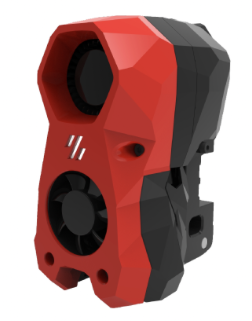
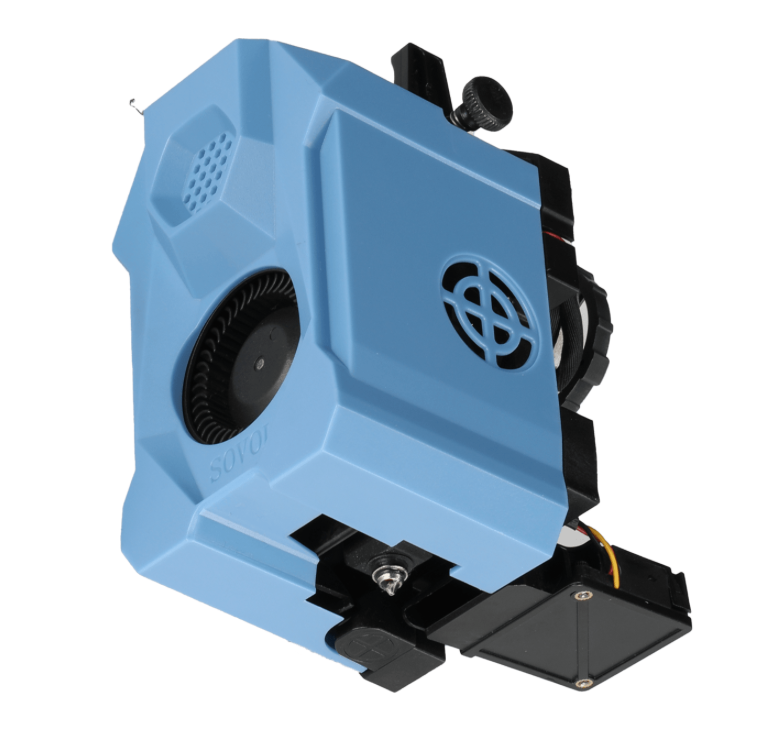
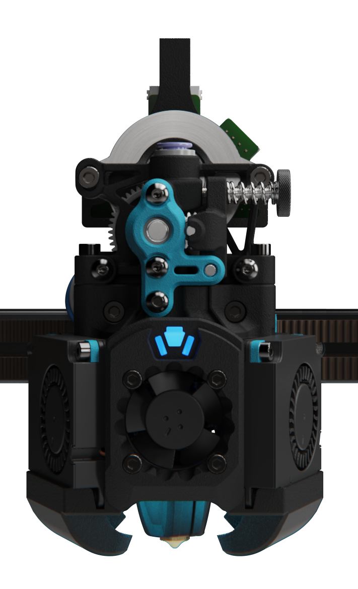

<!-- Use the page layout at TOC.md:  https://github.com/sdylewski/StealthChanger/blob/main/docs/TOC.md -->
# Toolheads

Many of the most common toolheads are supported.  You may build a dock for your existing toolhead, and then built new toolheads as other types. You can mix and match, but the configs get more complicated because you need to have different ones for each toolhead. 

Note that toolheads go hand-in-hand with their associated docks, and the options/mods available for them. 

Each toolhead page will contain specifics for the backplate, dock, and modifications for that toolhead.

<table>
<tr><th>Toolhead</th><th align="left">Quick Summary</th></tr>
<tr><td valign=top><strong><a href="Anthead.md">AntHead 
	</a></strong></td>
	<td valign=top><ul>
		<li>Uses 60mm wide docks</li>
    <li>Can use stubby docks?</li>
    <li>Default cowl and dock has built-in magnet holes for better docking</li>
	</ul></td></tr>
	
<tr>
	<td valign=top><strong><a href="A4T.md">A4T 
	</a></strong>
	</td>
	<td valign=top><ul>
	<li>Uses XX wide docks</li>
	<li>Requires Shorter Z joints like <a href="https://github.com/VoronDesign/VoronUsers/tree/main/printer_mods/hartk1213/Voron2.4_GE5C">Ge5C z-joints</a> so you don't bottom out your carriage when homing.</li>
		<li>Requires new smaller front idlers like the <a href="https://github.com/clee/VoronBFI">BFI</a> or <a href="https://github.com/DraftShift/StealthChanger/tree/main/UserMods/BT123/MiniBFI%20%2B%20MicroBFI">Mini BFI</a></li>
	</ul></td></tr>
	
<tr>
	<td valign=top><strong><a href="Dragonburner.md">Dragonburner & Rapidburner 
    </a></strong>
	</td>
	<td valign=top><ul><li>Uses 60mm wide docks.</li>
	<li>Can use stubby docks. </li>
	</ul>
  
  </td></tr>
	
<tr>
	<td valign=top><strong><a href="Stealthburner.md">Stealthburner 
    </a></strong>
	</td>
	<td valign=top><ul>
	<li>76mm wide dock. </li>
	<li>Docking is a bit harder? </li>
		</ul></td></tr>
		
<tr>
	<td valign=top><strong><a href="SV08.md">SV08 
	</a></strong>
	</td>
	<td valign=top>
	<ul>
	<li></li>
	<li></li>
	</ul>
	</td></tr>
		
<tr>
	<td valign=top><strong><a href="XOL.md">XOL 
	</a></strong>
	</td>
	<td valign=top>
	<ul>
	<li></li>
	<li></li>
	</ul>
	</td></tr>
<tr>
	<td valign=top><strong><a href="Yavoth.md">Yavoth 
	</a></strong>
	</td>
	<td valign=top>
	<ul>
	<li></li>
	<li></li>
	</ul>
	</td></tr>

</table>

## Selecting a new toolhead?

### Toolheads
* [Awesome-Toolheads](https://github.com/SartorialGrunt0/Awesome-Toolheads?tab=readme-ov-file)
* [Toolhead comparison](https://3dp-info.fyi/toolhead-comparison)

### Extruders
* [Awesome-Extruders](https://github.com/SartorialGrunt0/Awesome-Toolheads?tab=readme-ov-file)
* [Extruder comparision](https://3dp-info.fyi/extruder-comparison)

### Hotends
* TBD

