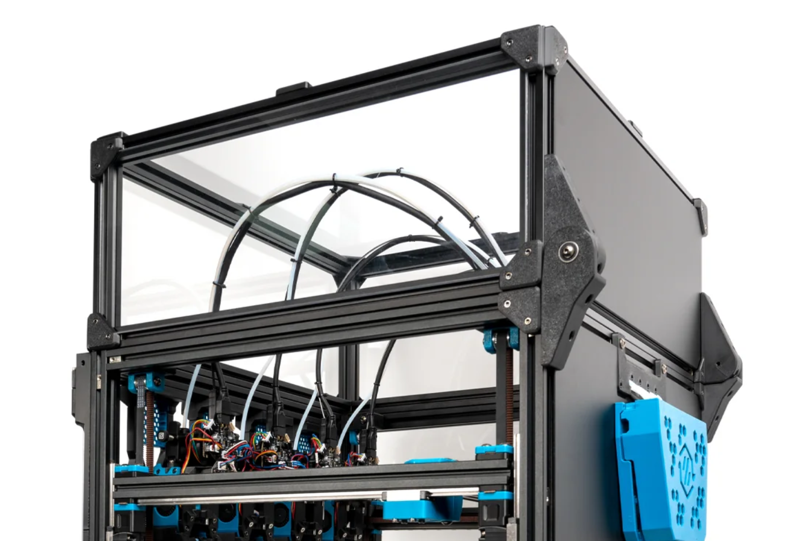

<!-- Use the page layout at TOC.md:  https://github.com/sdylewski/StealthChanger/blob/main/docs/TOC.md -->

# Top Hat

If you want to enclose your printer, a top hat is needed to allow the cables to extend above the original frame, but to still be enclosed. The curent recommendation is to use 200mm height of the top hat.  

You can pick one of the following options:

## LDO Kit Top Hat
A 200mm tall top hat is included in the [LDO top-hat kit](https://ldomotion.com/products/16607023627247272)
(add affiliate link?)

## Printed Top Hat
DraftShift Design has a <a href="https://github.com/DraftShift/Tophat">printed top hat!</a>

## Build your own
Depending on your situation, you can build your own with existing materials, or order extrusions from places like [Mitsumi USA](https://us.misumi-ec.com/vona2/detail/110302683830/?CategorySpec=unitType%3a%3a1%0900000042747%3a%3amig00000001423216%0900000042730%3a%3amig00000001495349%0900000042733%3a%3aa%0900000042720%3a%3aa&list=PageCategory) 
(add Mitsumi BOM for Voron 300, 350?) 

### Dimensions
Assuming the vertical extrusions are the corners, like a stock Voron frame has, you require four verticals, four horizontal X and four horizontal Y.

| Printer |   Z    | Stock X and Y |   Panels   |
|  ---    |  ---   |      ---      |     ---    |
|  250mm  | 180 x4 |     370 x8    | 385x155 x4 |
|  350mm  | 200 x4 |     420 x8    | 435x175 x4 |
|  350mm  | 200 x4 |     470 x8    | 485x175 x4 |

## Other

* [Panorama top hat](https://github.com/Theaninova/panorama-tophat) ([discord link](https://discord.com/channels/1226846451028725821/1281961080771448943))
  

## Top Hat Accessories

### Foam
It is a good idea to line the bottom of your tophat (or the top of your frame) with foam to help reduce air leaks. Thicker foam can be held in compression using latches for a superior seal.

### Hinges
With hinges you can open and close the top hat like a box

* [2020 & 1515 Tophat hinges](https://discord.com/channels/1226846451028725821/1279707532893360203) // TODO this is a discord link to user mod
* [LDO Top hat hinge](https://github.com/MotorDynamicsLab/LDOStealthChanger/tree/master/STLs)

### Latches
Latches ensure the top hat stays on the printer securely and tightly, squishing the foam between the top hat and the frame to create an air tight seal.

* [2020 Extrusion Latch for Voron Top-Hat or Fridge Door with M3 Screw ](https://www.printables.com/model/1271104-2020-extrusion-latch-for-voron-top-hat-or-fridge-d)
* [Annex style tophat connector](https://www.printables.com/model/931249-annex-style-extrusion-connector) ([discord link](https://discord.com/channels/1226846451028725821/1257927419596116040))

### Other mods

* [Top hat SC logo](https://github.com/DraftShift/StealthChanger/tree/main/UserMods/EddieSha04/Tophat%20SC%20LED%20Logo)
* [Top hat panel clips](https://github.com/DraftShift/StealthChanger/tree/main/UserMods/EddieSha04/Tophat)

## FAQ

**Quick Links:**
- [Do I need a top hat?](#do-i-need-a-top-hat)
- [Can I move the umbilical exits to the tophat back panel?](#can-i-move-the-umbilical-exits-to-the-tophat-back-panel)
- [Can I install a new exhaust plate on the tophat back panel?](#can-i-install-a-new-exhaust-plate-on-the-tophat-back-panel)

---

### Do I need a top hat?
If you are going to print with filament that requires chamber temperatures above room temperature then yes, otherwise no. You cannot enclose the printer without a hat.

### Can I move the umbilical exits to the tophat back panel?
Generally not. The geometry of the umbilical means it wants to be below the original top frame, and curve up into the tophat space.

### Can I install a new exhaust plate on the tophat back panel?
Often asked in the context of wanting to add a charcoal filter and/or fan to the tophat. Entirely do-able, just be careful not to snag the umbilicals and have a plan for how to unplug any wires when removing the tophat.

